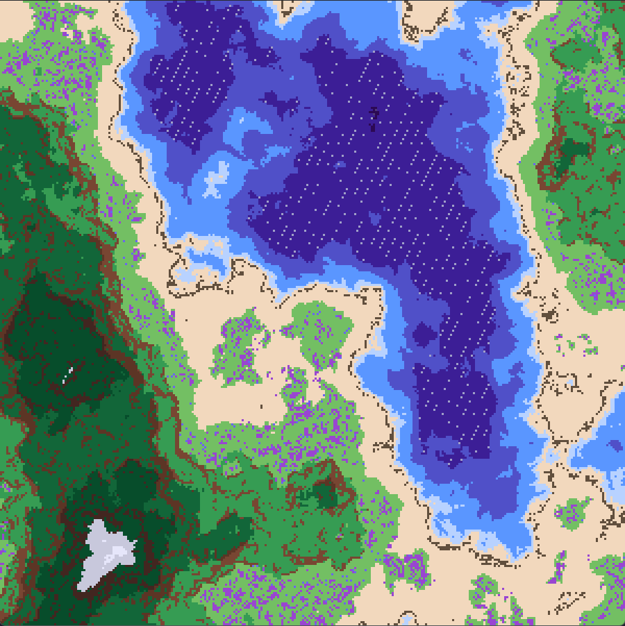
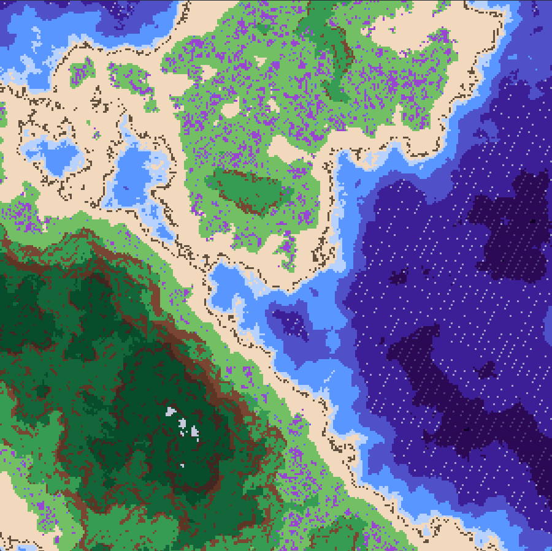
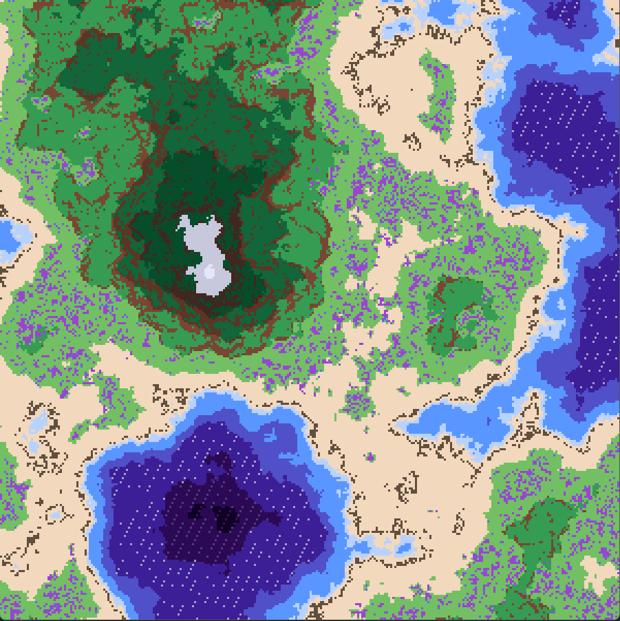
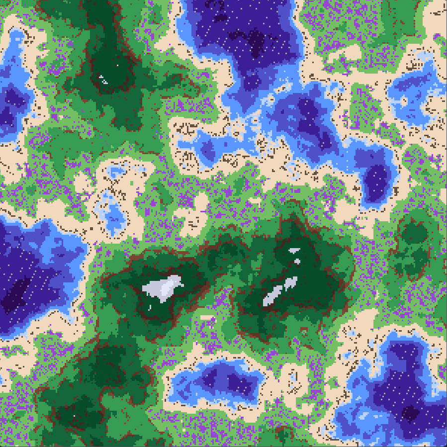
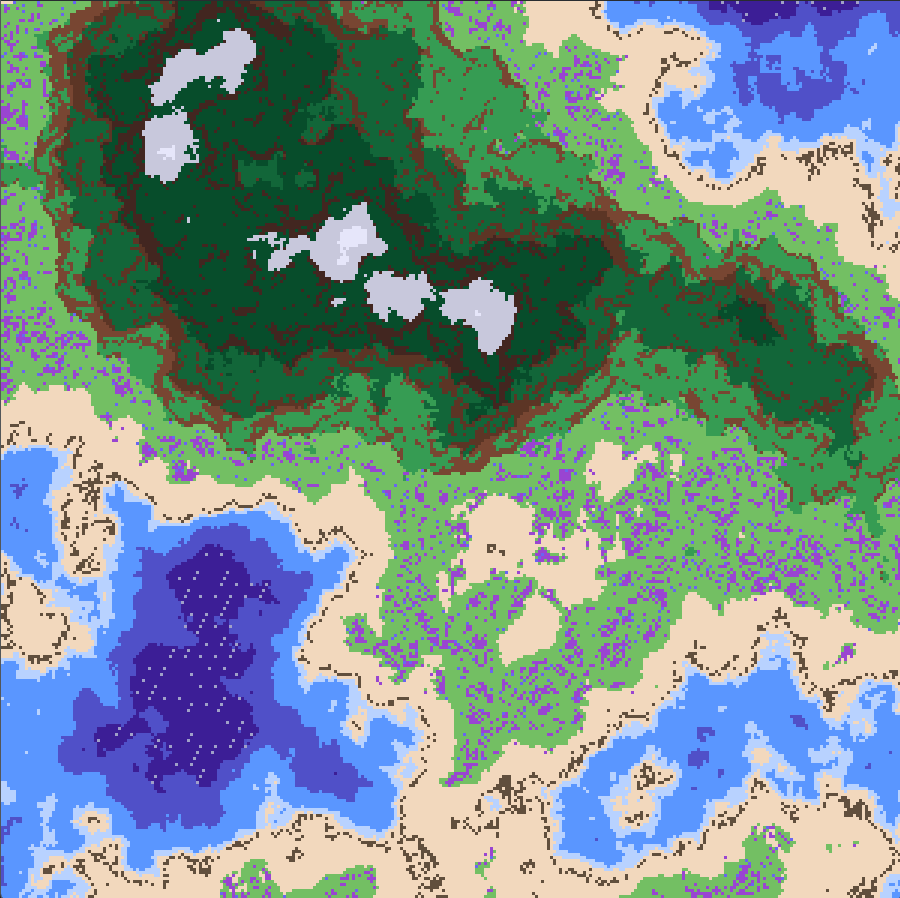
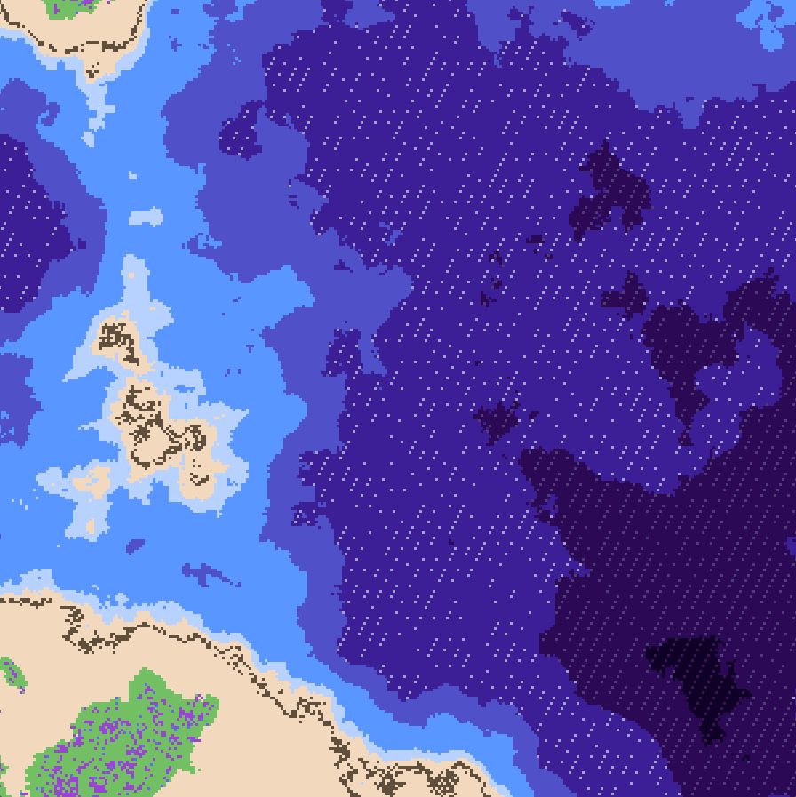
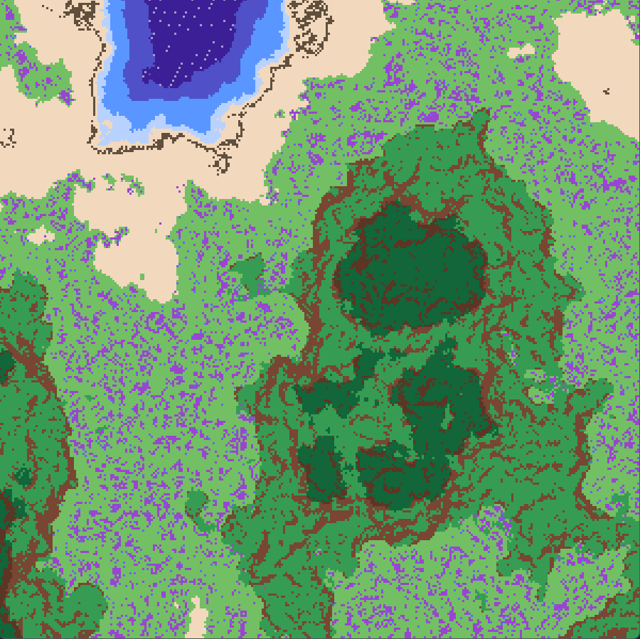
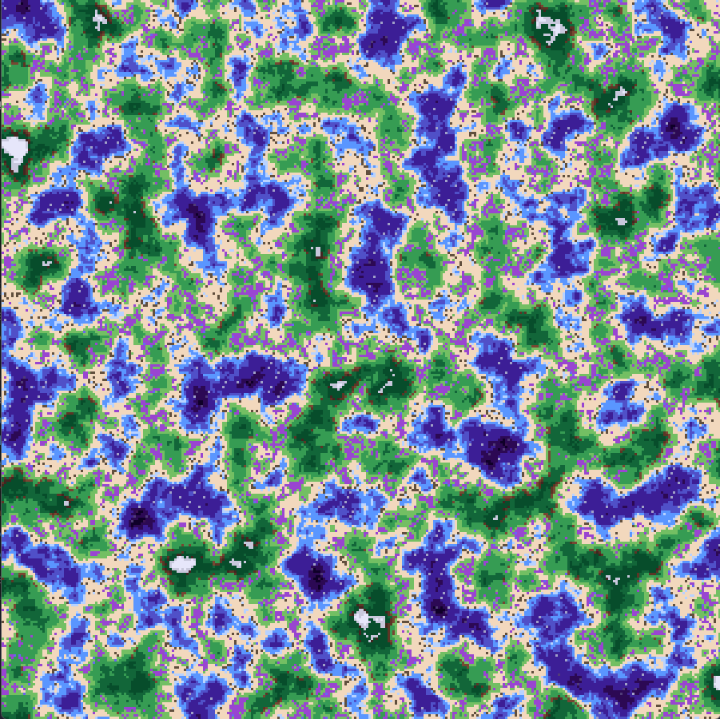

# Procedural Terrain Generator

-add scrolling gif here-

A real-time, infinite 2D terrain generator built with Python, Pygame, and NumPy. This project uses fractal Perlin noise to generate biomes, elevations, and simulated slopes for beautiful dynamic coloring.

## Features
- Infinite Generation: Terrain is generated and unloaded on-the-fly as the camera moves, allowing for an endless world.

- Fractal Perlin Noise: Uses multiple octaves of noise to create realistic geographic features, from deep oceans to jagged mountain peaks.

- Slope & Gradient Analysis: Calculates terrain steepness in real-time to dynamically apply textures like cliffs, meadows with flower fields, and rocky shorelines.

- Chunk-Based System: Efficiently manages memory by dividing the world into discrete chunks. The chunks are deterministic and same coordinates always generate same results.

## Controls
- WASD: Move the camera.

- Q/E: Zoom In / Zoom Out.

- R: Teleport to a random location in the infinite world.

- C: Toggle Cinematic Scroll mode.

## Installation
- Visit the itch.io page and download the windows executable or the source python code. -add itch link here when you upload it-

- Or, clone the project and run the python source code ```python chunk-map.py```. Note that you may need to install the dependencies ```pip install numpy pygame```.

## Gallery









